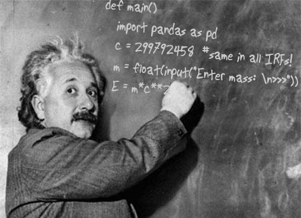

# <b>Data Analysis and Machine Learning Applications</b>

<!-- {: style="width: 550px; float: center; margin: 30px 0 30px 0; border: 10px"} -->

* **Course:** [PHYS 398MLA](https://physics.illinois.edu/academics/courses/PHYS398MLA)
* **Instructor:** Prof. Mark Neubauer, [msn@illinois.edu](mailto:msn@illinois.edu)
* **Lectures:** Mondays from 3-4:50 pm in 222 Loomis Laboratory of Physics
* **Need help?**
  * 
    * It sends message digests to people who aren't active in the room, so feel free to ask a question even if no one's around. 
    * Please do not post messages that give away answers to homework problems since posts are viewable by all students enrolled in the course. 
  * Look through and create [issues](https://github.com/illinois-mla/syllabus/issues)
  * Office Hours
    * Prof. Neubauer: Thursdays from 4-5 pm over Zoom

## Course Description

Welcome you to the Data Analysis and Machine Learning Application (for physicists) course!

In this course, you will learn fundamentals of how to analyze and interpret scientific data and apply modern machine learning tools and techniques to problems common in physics research such as classification and regression. This course offering is very timely given the explosion of interest and rapid development of data science and artificial intelligence. Every day there are new applications of machine learning to the physical sciences in ways that are advancing our knowledge of nature.

This course is designed to be interactive and collaborative, at the same time developing your own skills and knowledge. I initiated this course in 2018 from a viewpoint that we live in an increasingly data-centric world, with both people and machines learning from vast amounts of data. There has never been a time where early-career physicists such as yourself will benefit from a solid understanding in the basics of scientific data analysis, data-driven inference and machine learning, and working knowledge of the most important tools and techniques from modern data science than today.

This is the third offering of the course. I welcome your feedback on any aspect of the course so that I can work to improve the curriculum.

## Prerequisites

### Courses
* Credit or Concurrent Registration: [MATH 285](https://netmath.illinois.edu/college/math-285)
* Credit for [PHYS 225](https://physics.illinois.edu/academics/courses/profile/PHYS225) and [PHYS 325](https://physics.illinois.edu/academics/courses/profile/PHYS325)

### Hardware
* You need a laptop for this course. It is assumed that you have a laptop running MacOS, Linux or Windows for use both inside and outside of the class.

### Software
* Some knowledge of python preferred but is not required. You do need to have a working knowledge of the basics of computer programming.

### Setting up
* Instructions forthcoming

## Course Overview

Topics covered include:

* *Notebooks and numerical python*
* *Handling and Visualizing Data*
* *Finding structure in data*
* *Measuring and reducing dimensionality*
* *Adapting linear methods to nonlinear problems*
* *Estimating probability density*
* *Probability theory*
* *Statistical methods*
* *Bayesian statistics*
* *Markov-chain Monte Carlo in practice*
* *Stochastic processes and Markov-chain theory*
* *Variational inference*
* *Optimization*
* *Computational graphs and probabilistic programming*
* *Bayesian model selection*
* *Learning in a probabilistic context*
* *Supervised learning in Scikit-Learn*
* *Cross validation*
* *Neural networks*
* *Deep learning*

Topics will be demonstrated in-class through live-code examples/slides in Juypter notebooks.

## Class Participation

The lectures will include physics and data science pedagogy, demonstrated through live examples in Jupyter notebooks that you will work through in class. You are required to attend each lecture with your laptop and working environment. Attendance will be taken.

## Homework

Homework is an important part of the course where you will have an opportunity to apply the techniques you are learning to problems relevant to the analysis of scientific data. All assignments are listed within the [Course Outline](#course-outline). 

## Projects

Approximately halfway through the course, you will have the opportunity to choose from a set of projects based on open scientific data and apply what you have learned in the course. You will be asked to answer certain questions about the data, supported by your analysis and written up in a Jupyter notebook which you will submit. Your notebook will also include background information about how the data is generated, its scientific relevance and your methodology.

## Grading

* *Class Participation*: **~20%**
* *Homework*: **~45%**
* *Research project*: **~35%**

## Course Outline

<!--################### NO Lecture ######################-->

### [Jan 17] **NO LECTURE** (MLK Day)

<!--################### Lecture 01 ######################-->

### [Jan 24] **Lec 01**: *Introduction*

#### *Goals*
* Getting overview of the course, including reading list and homework assignments
* Setting up your environment

#### *Lecture notebooks*
* [Reading list](https://nbviewer.jupyter.org/github/illinois-mla/syllabus/blob/master/notebooks/References.ipynb)
* Course introduction
* Setup your environment
* Homework assignments

#### *Homework*
* Complete setting up your environment so that you can launch and execute notebooks

#### *Required reading*
* *A Whirlwind Tour of Python*, Jake VanderPlas: [free PDF](http://www.oreilly.com/programming/free/files/a-whirlwind-tour-of-python.pdf), notebooks [online](http://nbviewer.jupyter.org/github/jakevdp/WhirlwindTourOfPython/blob/master/Index.ipynb).

#### *Supplemental reading*
* None

<!--################### Lecture 02 ######################-->

### [Jan 31] **Lec 02**: Data Science

#### Goals
* Gain familiarity with Jupyter Notebooks and Numerical python
* Learn about handling and describing data

#### Lecture notebook(s)
* Notebooks and numerical python
* Handle data

#### Homework
* Homework 1: Numerical python and data handling

#### Supplemental reading
  * [IPython: Beyond Normal Python](https://jakevdp.github.io/PythonDataScienceHandbook/01.00-ipython-beyond-normal-python.html)
  * [Python Data Science Handbook](https://jakevdp.github.io/PythonDataScienceHandbook/index.html)
  * [Introduction to NumPy](https://jakevdp.github.io/PythonDataScienceHandbook/02.00-introduction-to-numpy.html)
  * [Data Manipulation with Pandas](https://jakevdp.github.io/PythonDataScienceHandbook/03.00-introduction-to-pandas.html)

<!--################### Lecture 03 ######################-->

### [Feb 07] **Lec 03**: Visualizing & Finding Structure in Data

#### Goals
  * Learn about visualizing data
  * Learn about the importance of clustering data in physics
  * Learn how to find structure in data (clustering)
     * KMeans, Spectral Clustering, DBSCAN

#### Lecture notebook(s)
  * Visualize data
  * Find structure in data

#### Homework
  * None

#### Supplemental reading
  * [Scikit-learn](http://scikit-learn.org)
  * [Whitening transformation](https://en.wikipedia.org/wiki/Whitening_transformation)

<!--################### Lecture 04 ######################-->

### [Feb 14] **Lec 04**: Dimensionality & Linearity

#### Goals
  * Measure and reduce dimensionality
  * Adapt linear models to nonlinear problems

#### Lecture notebook(s)
  * Measure and reduce dimensionality
  * Adapt linear methods to nonlinear problems

#### Homework
  * Homework 2: Visualization, Covariance and Correlation

#### Supplemental reading
  * [Principle Component Analysis](https://en.wikipedia.org/wiki/Principal_component_analysis)
  * [Blind Signal Separation](https://en.wikipedia.org/wiki/Blind_signal_separation)

<!--################### Lecture 05 ######################-->

### [Feb 21] **Lec 05**: Kernel Functions & Probability Theory

#### Goals
* Learn about Kernel functions
* Learn about Probability Theory

#### Lecture notebook(s)
* Kernel Functions
* Probability theory

#### Homework
* Homework 3: Expectation-Maximization Algorithm, K-Means, Principle Component Analysis

#### Supplemental reading
  * [Kernel Method](https://en.wikipedia.org/wiki/Kernel_method)
  * [Mercer's Theorem](https://en.wikipedia.org/wiki/Mercer%27s_theorem)
  * [Similarity Measure](https://en.wikipedia.org/wiki/Similarity_measure)
  * [Nonlinear Dimensionality Reduction by Locally Linear Embedding](http://science.sciencemag.org/content/290/5500/2323)

  <!--################### Lecture 06 ######################-->

### [Feb 28] **Lec 06**: Probability Density Estimation & Statistics

#### Goals
  * Estimate probability density
  * Learn about Statistical Methods

#### Lecture notebook(s)
  * Estimate probability density from Data
  * Statistical methods

#### Homework
  * Homework 4: Probability

#### Supplemental reading
  * [Positive Definite Matrix definition](https://en.wikipedia.org/wiki/Positive-definite_matrix)
  * [AstroML: Machine Learning and Data Mining for Astronomy](http://www.astroml.org)
  * [Freedman-Diaconis Rule for choice of binning](https://en.wikipedia.org/wiki/Freedman–Diaconis_rule)
  * [Kernel Density Estimation](https://en.wikipedia.org/wiki/Kernel_density_estimation)
  * [Algorithms for calculating variance](https://en.wikipedia.org/wiki/Algorithms_for_calculating_variance)
  * [Probability Mass Function](https://en.wikipedia.org/wiki/Probability_mass_function)

<!--################### Lecture 07 ######################-->

### [Mar 07] **Lec 07**: Bayesian Statistics & Markov-chain Monte Carlo

#### Goals
  * Learn about Bayesian Statistics
  * Markov-chain Monte Carlo put into practice

#### Lecture notebook(s)
  * Bayesian statistics
  * Markov-chain Monte Carlo in practice

#### Homework
  * Homework 5: Kernel Density Estimation

#### Supplemental reading
  * [Beta Distribution](https://en.wikipedia.org/wiki/Beta_distribution)
  * [Gamma Function](https://en.wikipedia.org/wiki/Gamma_function)
  * [Uninformative Priors](https://en.wikipedia.org/wiki/Prior_probability#Uninformative_priors)
  * [Conjugate Priors](https://en.wikipedia.org/wiki/Conjugate_prior)
  * [Importance Sampling](https://en.wikipedia.org/wiki/Importance_sampling#Application_to_probabilistic_inference)
  * [C. Maes, <i>An introduction to the theory of Markov processes mostly for physics students</i>](https://fys.kuleuven.be/itf/staff/christ/files/pdf/pub/markovlectures2015.pdf)
  * [Foreman-Mackey, Hogg, Lang, Goodman, emcee: The MCMC Hammer](https://arxiv.org/abs/1202.3665)

<!--################### NO Lecture ######################-->

### [Mar 14] **NO LECTURE (Spring Break)**

<!--################### Lecture 08 ######################-->

### [Mar 21] **Lec 08**: Stochastic Processes, Markov Chains & Variational Inference

#### Goals
  * Learn about Stochastic processes in the realm of Data Science
  * Learn about Markov-chain Theory
  * Learn about the Variational Inference Method

#### Lecture notebook(s)
  * Stochastic processes and Markov-chain theory
  * Variational inference

#### Homework
  * Homework 6: Bayesian Statistics and Markov Chain Monte Carlo

#### Supplemental reading
  * [C. Maes, <i>An introduction to the theory of Markov processes mostly for physics students</i>](https://fys.kuleuven.be/itf/staff/christ/files/pdf/pub/markovlectures2015.pdf)
  * [Example of dependence without correlation](https://en.wikipedia.org/wiki/Uncorrelated_random_variables#Example_of_dependence_without_correlation)
  * [Conditional Independence](https://en.wikipedia.org/wiki/Conditional_independence)
  * [Inverse Problem](https://en.wikipedia.org/wiki/Inverse_problem)
  * [Brownian Motion](https://en.wikipedia.org/wiki/Brownian_motion)
  * [Hamiltonian Mechanics](https://en.wikipedia.org/wiki/Hamiltonian_mechanics)
  * [Cannonical Distribution](https://en.wikipedia.org/wiki/Canonical_ensemble)
  * [Hamiltonian MC](http://arogozhnikov.github.io/2016/12/19/markov_chain_monte_carlo.html)
  * [Autocorrelation](https://en.wikipedia.org/wiki/Autocorrelation)

<!--################### Lecture 09 ######################-->

### [Mar 28] **Lec 09**: Optimization, Comput. Graphs & Prob. Prog.

#### Goals
* Learn about Optimization and Stochastic Gradient Descent
* Learn about Frameworks for Computational Graphs
* Learn about Probabilistic Programming methods

#### Lecture notebook(s)
* Optimization
* Frameworks for computational graphs and probabilistic programming

#### Homework
* Homework 7: Markov Chains

#### Supplemental reading
* [Convex Functions](https://en.wikipedia.org/wiki/Convex_function)
* [Jensen's Inequality](https://en.wikipedia.org/wiki/Jensen's_inequality)
* [Finite Difference Equations](https://en.wikipedia.org/wiki/Finite_difference)
* [Automatic Differentiation](https://en.wikipedia.org/wiki/Automatic_differentiation)
* [Rosenbrock function](https://en.wikipedia.org/wiki/Rosenbrock_function)
* [Nelder-Mead method](https://en.wikipedia.org/wiki/Nelder–Mead_method)
* [Conjugate Gradient Method](https://en.wikipedia.org/wiki/Conjugate_gradient_method)
* [Newton's CG method](https://en.wikipedia.org/wiki/Newton's_method_in_optimization)
* [Powell's method](https://en.wikipedia.org/wiki/Powell's_method)
* [BFGS method](https://en.wikipedia.org/wiki/Broyden-Fletcher-Goldfarb-Shanno_algorithm)
* [Stochastic Gradient Descent](https://en.wikipedia.org/wiki/Stochastic_gradient_descent)
* [Adam Optimizer](https://arxiv.org/abs/1412.6980)
* [Softmax Function](https://en.wikipedia.org/wiki/Softmax_function)

<!--################### Lecture 10 ######################-->

### [Apr 04] **Lec 10**: Bayesian Models & Probabilistic Learning

#### Goals

#### Lecture notebook(s)
* Bayesian model selection
* Learning in a probabilistic context

#### Homework
* None

#### Supplemental reading
* [Jeffreys proposed scale to interpret a Bayes Factor](https://en.wikipedia.org/wiki/Bayes_factor#Interpretation)

<!--################### Lecture 11 ######################-->

### [Apr 11] **Lec 11**: Supervised Learning & Cross Validation

#### Goals
* Learn about Cross Validation

#### Lecture notebook(s)
* Supervised learning in Scikit Learn
* Cross validation

#### Homework
* None

#### Supplemental reading
* [Coefficient of Determination](https://en.wikipedia.org/wiki/Coefficient_of_determination)

<!--################### Lecture 12 ######################-->

### [Apr 18] **Lec 12**: Artificial Neural Networks

#### Goals
* Learning and Inference using Neural Networks

#### Lecture notebook(s)
* Neural networks

#### Homework
* Homework 8: Cross Validation and Neural Networks

#### Supplemental reading
* [Artificial Neural Networks](https://en.wikipedia.org/wiki/Artificial_neural_network)
* [Types of Neural Networks](https://towardsdatascience.com/the-mostly-complete-chart-of-neural-networks-explained-3fb6f2367464)
* [Backpropogation](https://en.wikipedia.org/wiki/Backpropagation)
* [Training Summary](https://google-developers.appspot.com/machine-learning/crash-course/backprop-scroll/)

<!--################### Lecture 14 ######################-->

### [Apr 25] **Lec 14**: Deep Learning

#### Goals
* Learn about Deep Learning

#### Lecture notebook(s)
* Deep learning

#### Homework
* None

<!--################### Lecture 15 ######################-->

### [May 02] **Lec 14**: Deep Learning

#### Goals
* Learn about Deep Learning

#### Lecture notebook(s)
* Deep learning

#### Homework
* None

## Resources

### References

* You can find the references list, including required and recommended reading, at [Reading list](https://nbviewer.jupyter.org/github/illinois-mla/syllabus/blob/master/notebooks/References.ipynb)

* Some quick reference guides
    * [Linux Bash Shell](https://learncodethehardway.org/unix/bash_cheat_sheet.pdf)
    * [Github](https://services.github.com/on-demand/downloads/github-git-cheat-sheet.pdf)
    * [Conda](https://conda.io/docs/_downloads/conda-cheatsheet.pdf)
    * [Python](http://ehmatthes.github.io/pcc/cheatsheets/README.html)
    * [Markdown](http://packetlife.net/media/library/16/Markdown.pdf)
    * Jupyter Notebooks: [Interface](http://datacamp-community.s3.amazonaws.com/48093c40-5303-45f4-bbf9-0c96c0133c40), [Keyboard shortcuts](https://www.cheatography.com/weidadeyue/cheat-sheets/jupyter-notebook/pdf_bw)

### Tools

* Sharing code snippets: [gist.github.com](https://gist.github.com/)
* Asking questions of broader development community: [Stack Overflow](http://stackoverflow.com/)

#### *Git* and *GitHub*

* [Official GitHub Help](https://help.github.com/)
* [Recommended resources](http://hackerhours.org/resources.html#github)

#### *Anaconda* and *Conda*
* [Official site](https://www.anaconda.com)
* [Conda](https://conda.io/docs)

#### *Project Jupyter*
* [Official site](http://jupyter.org)
* [nbviewer](https://nbviewer.jupyter.org)

## Acknowledgements

I would like to acknowledge [David Kirby](https://github.com/dkirkby) at the University of California at Irvine for the materials and setup for which this course is based and the helpful discussions we have had. I would like to thank [Matthew Feickert](https://github.com/matthewfeickert) and [Dewen Zhong](https://github.com/zhonglol) for their guidance and contributions to the course. I also acknowledge the course at <a href="https://github.com/advanced-js">github.com/advanced-js</a> for which the syllabus template was utilized.

## _________________________________________

Material for a [University of Illinois](http://illinois.edu) course offered by the [Physics Department](https://physics.illinois.edu).

Content is maintained on [github](https://github.com/illinois-mla) and distributed under a [BSD3 license](https://opensource.org/licenses/BSD-3-Clause).

 
